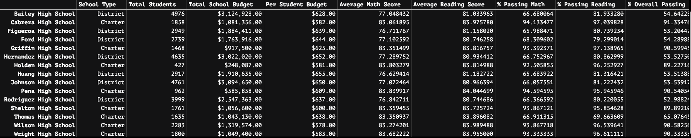
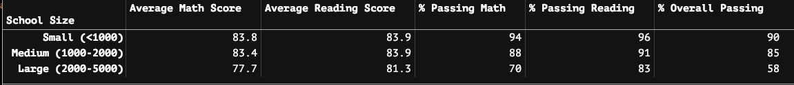
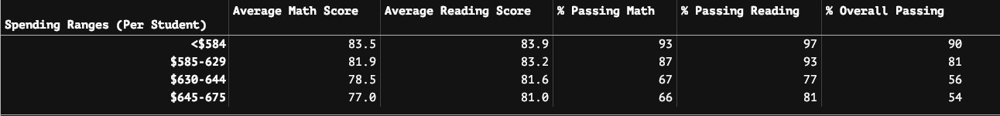
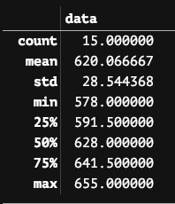
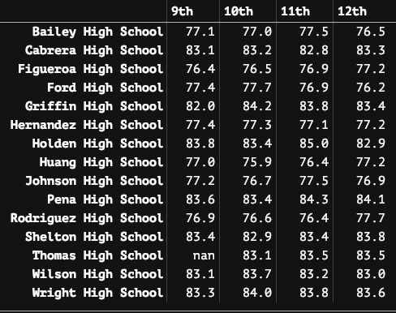

# Module 4 | Assignment - PyCitySchools

## **Overview of the School District Analysis**

Maria is an urban high school district data analyst. She is responsible for processing various types of data from the schools in her district into reports. These reports are used by the school district board and superintendant to decide on the district’s budget provisions for each school.

Using collected information both about the [schools](Resources/schools_complete.csv) as well as their [students’ academic performances](Resources/students_complete.csv), we must consolidate this data in order to draw conclusions regarding the schools’ educational success across the districts.

## **Results**

As we review the data wrangled with our Pandas script, there are some immediately obvious correlations between some of the metrics that were accounted for in this analysis. Below, each one of these is assessed for possible correlations (since the `Average Math/Reading/Overall Score` and `% Math/Reading/Overall Passing` are interdependent, we will only address the percentage):

### All Schools Summary

### District Summary

### School District “Controlled Variables”

- #### School Type

  

  

  - There is strong correlation between the type of school and grade outcomes, `Charter` schools performed better than `District` schools across the board.
  - `Charter` schools tended to be smaller student bodies than `District` schools.
  - Unexpectedly, the `Per Student Budget` for `Charter` schools was generally lower than `District` schools, however, this is likely due to the fact that `Charter` schools are privately paid/funded.

- #### Total Students (School Size)

  

  - Schools that had larger `Total Students` were less likely to perform well through their grades.
  - `Charter` schools tended to be smaller student bodies than `District` schools.

- #### Total School Budget

- 

  - As beforementioned, there was a negative correlation between `Total School Budget` and positive academic outcomes. This may be attributed back to the fact that larger budgets are seen with at the schools with more `Total Students`.

- #### Per Student Budget

- 

  - As mentioned under the first bullet, the `Per Student Budget` for `Charter` schools was generally lower than `District` schools (likely due to the fact that `Charter` schools are privately paid/funded).

  - When it comes down to the actual spread of the budget per student, it doesn’t look like there’s all that much inequity….

    

    

- ### Academic Outcomes (based on Math and Reading)

- 

- #### % Passing Math

  - `% Passing Math` was lower than `% Passing Reading` across the board.
  - `District` schools seemed to have quite exceptionally low values, especially when compared to `Charter` schools.
    - `Average Math Scores` were higher than one might expect based on the percentage, meaning there are likely a few students who are heavily influencing the statistics.

- #### % Passing Reading

  - `% Passing Reading` was higher than `% Passing Math`.
  - `Charter` schools demonstrated essentially consistent `Average Scores` between both Math and Reading, meaning these curriculae are likely equally strong and funded.

- #### % Overall Passing

  - `% Overall Passing` was lower than either `% Passing Math`  or `% Passing Reading` likely due to the fact that students are more often failing one of the two and not both together.

  - The disparity between the bottom and top five schools in their `% Overall Passing` is astonishing. There is nearly a 40% difference between these two school groups. This is highly suggestive that their needs to be a redivision of the budget funds between the `Charter` and `District` schools (again, likely because they are already privately-funded *and* receive funding from the district).

    

  - It is interesting to note that within each school, there was very little variance across high school classes. This is helpful as it indicates that there are  less variables needing to be considered.

## **Summary**

The mysterious and sudden disappearance of 461 freshman highschoolers turned out to be quite convenient for `Thomas High School` financially, in terms of landing budgeting from the district:

1. Those 9th graders that were removed from the dataset generally exhibited poorer academic performance than the other classes that were included, thus artificially inflating both their average and percentage of  Math and Reading grades.
2. Unless we thought to consider this difference in the calculation, the budget per student would also be artificially increased assuming one hadn’t accounted for the total budget preset for those students.
3. This, consequently, reduces the number of students that they are reporting in their `Total Students`.
4. Lastly, and most suspiciously, the exclusion of these 9th grader datapoints bumped the school out of the bottom five, allowing them to avoid the negative spotlight of that categorization.

